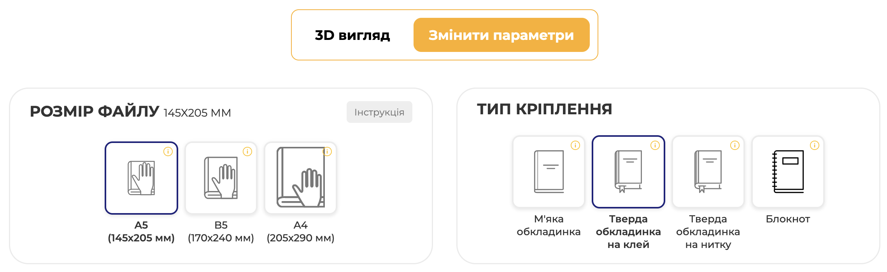
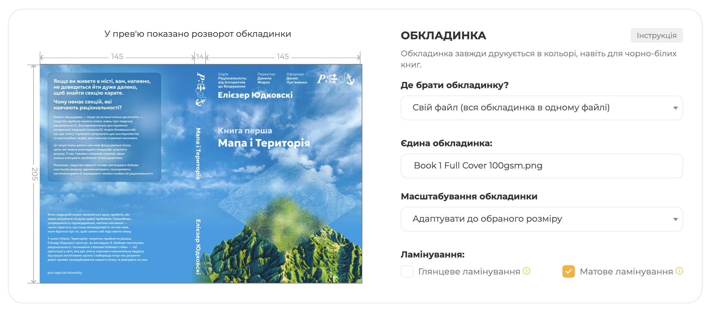
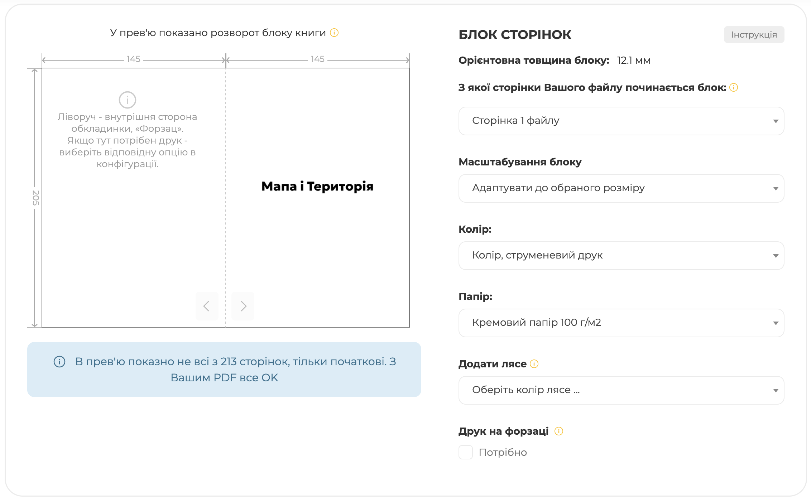
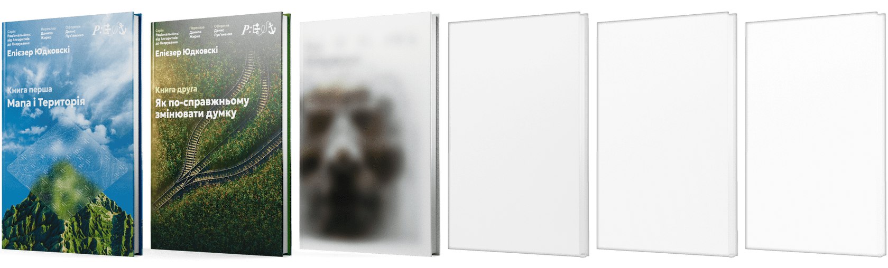

# Раціональність самвидав

Ми не продаємо переклади раціональності, але пропонуємо самостійний друк – якісних примірників у твердій палітурці – через [printto.ua](https://printto.ua). Друкують швидко (~2 тижні) і відносно недорого як для накладів від 1 примірника (ціни нижче). Ми підготували більшість – файли і налаштування – за вас, решта займе  ~15–20 хв. часу.

## Файли

| Файл | Книга 1. Мапа і Територія | Книга 2. Як по-справжньому змінювати думку | Книга 3. Машина у духові |
|---|---|---|---|
| Сторінки в ч/б | [Завантажити](https://github.com/DanTheStrongworded/rationality-ua/raw/refs/heads/print-bw/assets/pdf/print/%D0%A0%D0%B0%D1%86%D1%96%D0%BE%D0%BD%D0%B0%D0%BB%D1%8C%D0%BD%D1%96%D1%81%D1%82%D1%8C%20%D0%B2%D1%96%D0%B4%20%D0%90%20%D0%B4%D0%BE%20%D0%AF.%20%D0%9A%D0%BD%D0%B8%D0%B3%D0%B0%20%D0%9F%D0%B5%D1%80%D1%88%D0%B0%20145x205mm.pdf) | [Заявити про зацікавленість](https://t.me/c/voice_pre_post/20860) | Перекладається |
| Сторінки в кольорі | [Завантажити](https://github.com/DanTheStrongworded/rationality-ua/raw/refs/heads/main/assets/pdf/print/%D0%A0%D0%B0%D1%86%D1%96%D0%BE%D0%BD%D0%B0%D0%BB%D1%8C%D0%BD%D1%96%D1%81%D1%82%D1%8C%20%D0%B2%D1%96%D0%B4%20%D0%90%20%D0%B4%D0%BE%20%D0%AF.%20%D0%9A%D0%BD%D0%B8%D0%B3%D0%B0%20%D0%9F%D0%B5%D1%80%D1%88%D0%B0%20145x205mm%20Laser%20Color.pdf) | [Заявити про зацікавленість](https://t.me/c/voice_pre_post/20860) | Перекладається |
| Обкладинка | [Завантажити](https://github.com/DanTheStrongworded/rationality-ua/raw/refs/heads/main/assets/pdf/print/Book-1-Full-Cover-100gsm.png) | [Заявити про зацікавленість](https://t.me/c/voice_pre_post/20860) | Перекладається |

Збережіть сторінки бажаної версії (ч/б або колір) та обкладинку собі на комп'ютер. Станом на вересень 2026 ч/б коштуватиме десь 480 грн, кольоровий — до 990 грн.

## Printto

1. Створіть акаунт [в Printto](printto.ua). Завантажте PDF блоку з таблиці вище у [Мої файли](https://printto.ua/cabinet/files) через поле завантаження:

    

2. Після завантаження вас перекине на сторінку файлу. Перейдіть на вкладку «Змінити параметри», оберіть розмір A5 (145×205 мм) і тверду обкладинку на клей або нитку (дорожче):

    

3. У блоці «Обкладинка» оберіть «Свій файл (вся обкладинка в одному файлі)», додайте файл обкладинки з таблиці, масштабування — «Адаптувати», ламінація — краще матова.

    

4. У «Блок сторінок» виставте початок блока з 1-ї сторінки, масштабування — «Адаптувати», струменевий друк – він чіткіший – ч/б або в кольорі; папір — 100 г/м², обкладинка ідеально підходить під таку товщину. Ми радимо кремовий:

    

5. Додайте книгу до кошика, заповніть дані доставки й натисніть «Оформити замовлення». Готово!

> Ви можете отримати промокод на знижку в 5% якщо потримаєте замовлення у корзині 1–2 дні. Ще є знижки за більший наклад якщо домвитись з іншими бажаючими роздрукувати. Координуватися можна [тут](https://t.me/c/voice_pre_post/20860).

## Вигляд

